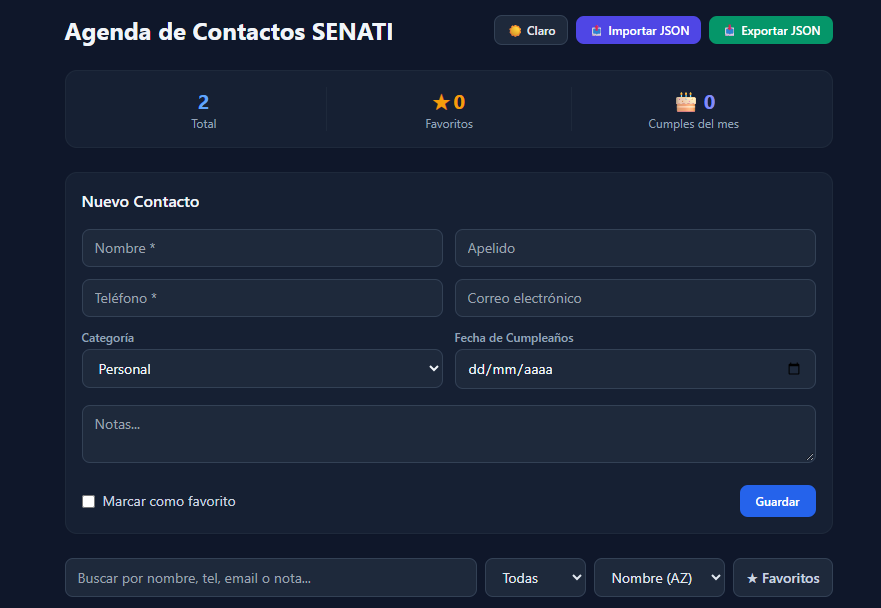
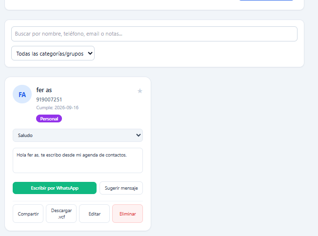

# Agenda de Contactos Web - SENATI

Este proyecto es una aplicación web moderna para la gestión de contactos (CRUD), desarrollada como parte de las actividades académicas de SENATI. Utiliza React, Vite, Tailwind CSS y persiste la información localmente mediante SQLite (WASM/sql.js).

## 📸 Capturas de Pantalla

### 1. Vista Principal, Estadísticas y Nuevo Grupo
Esta vista muestra el panel superior con la exportación/importación de base de datos `.DB`, las estadísticas generales, el módulo para la creación de nuevos grupos y el formulario completo para registrar un **Nuevo Contacto**.



### 2. Lista de Contactos y Funciones (`ContactoCard`)
Muestra las tarjetas detalladas de contactos con las siguientes características:
- Avatar con iniciales generadas automáticamente.
- Mensajería para WhatsApp con selector de plantillas (*Saludo*, *Recordatorio*, *Felicitación*) y botón **Sugerir mensaje**.
- Exportación directa a formato vCard (`.vcf`), opción de compartir, editar y eliminar.



## 🚀 Características Principales

- **Gestión de Contactos:** Crear, editar, eliminar y marcar contactos como favoritos.
- **Base de Datos Local (SQLite):** Persistencia en cliente con capacidad de **exportar** e **importar** archivos `.db`.
- **Grupos Dinámicos:** Creación e integración instantánea de grupos para categorizar contactos.
- **Acciones Rápidas por Contacto:** Integración con WhatsApp, vCard, compartir y gestión de favoritos.
- **Búsqueda y Filtros:** Filtrado dinámico por texto o por categorías/grupos.

## 🛠️ Instrucciones de Instalación y Ejecución

1. **Requisitos:** Tener instalado [Node.js](https://nodejs.org/) (v18 o superior).
2. **Instalar Dependencias:**
   ```bash
   npm install